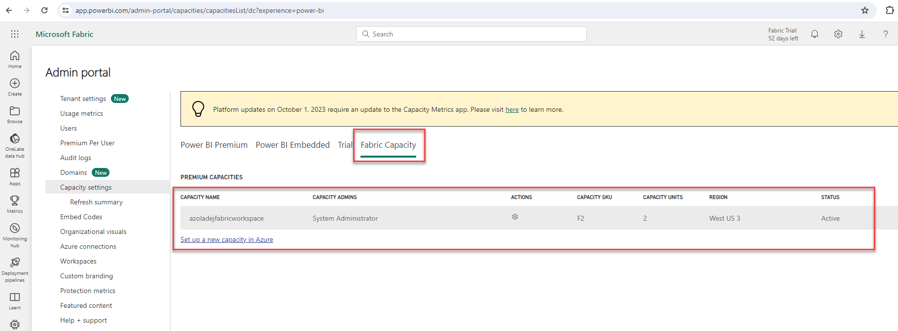

This is a step by step guide walking you through moving your Power BI Workspace from being backed by a Premium capacity to a Fabric Capacity.

1.  Log into your Powerbi dashboard - [Power
    BI](https://app.powerbi.com/home?experience=power-bi)

    1.  Click settings \> navigate to **Admin Portal**

>  alt="A screenshot of a phone Description automatically generated" />

2.  Click on **Capacity settings** then toggle to the **Fabric
    Capacity** tab

    1.  Click on the **Purchase** button to purchase a Fabric Capacity.

2.  Navigate to Azure Portal to complete the process of purchasing a
    Microsoft Fabric Capacity SKU.  
    

3.  Go back to your PowerBI and you will notice the **Fabric Capacity**
    has been successfully provisioned.  
    

**Assign your PowerBI workspace to the new Fabric Capacity**

To migrate your Power BI and Fabric artifacts, you can simply reassign
your workspaces to the new Fabric capacity.

1.  Click on **Workspaces** on the left menu option

2.  Reassign workspaces to the new Fabric capacity(s) individually from
    each workspace or by bulk assigning them in the Admin Portal.

    1.  **Individually reassigning:** You can also assign a workspace to
        the newly created Fabric Capacity from the settings of that
        workspace. To move a workspace into a capacity, you must have
        admin permissions to that workspace, and also capacity
        assignment permissions to that capacity.

    2.  **Bulk assigning in the Admin Portal:** Admins, when managing a
        capacity in the admin portal, can see Workspaces assigned to
        this capacity section that allows you to assign workspaces to
        the newly created Fabric Capacity

