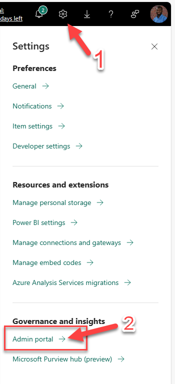

This is a step by step guide walking you through moving your Power BI Workspace from being backed by a Premium capacity to a Fabric Capacity.

## Prerequisites ##

Before migrating your Power BI workspace to a Fabric Capacity SKU,
ensure you have the following roles or permissions:

1.  **Power BI Service Admin or Power BI Admin:** Enables full
    administrative access to the Power BI service.

2.  **Azure Subscription Owner or Contributor:** Necessary for managing
    Fabric Capacity SKUs in the Azure environment.

3.  **Power BI Workspace Contributor or Admin:** Grants permissions to
    manage workspace content and settings.

4.  **Access to Azure Portal:** Required for managing the Fabric
    Capacity SKU and associated resources.

5.  **Azure Resource Group Contributor:** In some cases, you may need
    permissions at the resource group level within Azure to manage
    resources that are part of the migration process.

Finally, you can buy a Fabric capacity reservation in the [Azure
portal](https://portal.azure.com/#view/Microsoft_Azure_Reservations/ReservationsBrowseBlade)
and Pay for the reservation [up front or with monthly
payments](https://learn.microsoft.com/en-us/azure/cost-management-billing/reservations/prepare-buy-reservation).
To buy a reservation:

1.  You must have the owner role or reservation purchaser role on an
    Azure subscription that is of type Enterprise or Pay-As-You-Go or
    Microsoft Customer Agreement for at least one subscription.

## Overview of migration to Microsoft Fabric capacity ##

1.  Access your Power BI dashboard - [Power
    BI](https://msit.powerbi.com/home?experience=power-bi)

    1.  Navigate to the settings \> navigate to **Admin Portal**

>  alt="A screenshot of a phone Description automatically generated" />

2.  In the Admin Portal, navigate to **Capacity settings** then toggle
    to the **Fabric Capacity** tab

    1.  Click on the **Purchase** button to purchase a Fabric Capacity.

        1.  Note: It will open Azure Portal in another browser.

2.  Navigate to Azure Portal to complete the process of purchasing a
    Microsoft Fabric Capacity SKU.  
    

3.  Return to your PowerBI and you will notice the **Fabric Capacity**
    has been successfully provisioned.  
    

## Assign your PowerBI workspace to the new Fabric Capacity ##

To migrate your Power BI workspace and artifacts, you can simply
reassign your workspaces to the new Fabric capacity.

1.  Click on **Workspaces** on the left menu option

2.  Reassign workspaces to the new Fabric capacity(s) individually from
    each workspace or by bulk assigning them in the Admin Portal.

    1.  **Individually reassigning:** You can also assign a workspace to
        the newly created Fabric Capacity from the settings of that
        workspace. To move a workspace into a capacity, you must have
        admin permissions to that workspace, and also capacity
        assignment permissions to that capacity.

    2.  **Bulk assigning in the Admin Portal:** Admins, when managing a
        capacity in the admin portal, can see Workspaces assigned to
        this capacity section that allows you to assign workspaces to
        the newly created Fabric Capacity

3.  Click the **Save** button to complete the reassignment process.

## Final note ##

It is recommended that your Power BI region matches with the Microsoft
Fabric Capacity region to avoid any latency or performance issues.